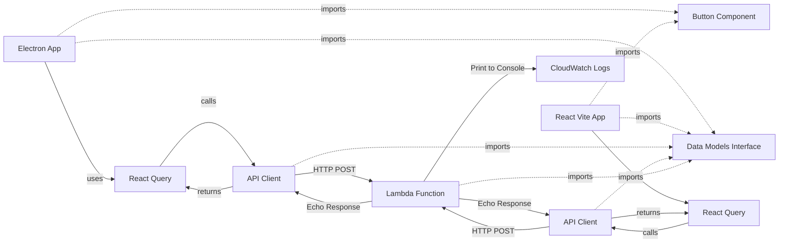

# Simplified Architecture for Initial Implementation

## Overview

Minimal hybrid platform architecture with three applications sharing a Button component and a simple API endpoint. This is a stripped-down version focusing on basic integration between Electron desktop app, React Vite web app, and AWS Lambda API.

## System Components

1. **Desktop Application (Electron)** - Loads and displays Button component
2. **Web Application (React Vite)** - Loads and displays Button component  
3. **Serverless API (AWS Lambda)** - Receives HTTP requests, prints input, echoes back response

## Data Flow



## Package Architecture

### Dependency Graph

```
apps/desktop
  ├─> @nx-hybrid-platform/ui-components (Button)
  ├─> @nx-hybrid-platform/api-client
  ├─> @nx-hybrid-platform/data-models
  └─> @tanstack/react-query (React Query)

apps/web
  ├─> @nx-hybrid-platform/ui-components (Button)
  ├─> @nx-hybrid-platform/api-client
  ├─> @nx-hybrid-platform/data-models
  └─> @tanstack/react-query (React Query)

apps/api
  └─> @nx-hybrid-platform/data-models

@nx-hybrid-platform/ui-components
  └─> (no dependencies)

@nx-hybrid-platform/data-models
  └─> (no dependencies)

@nx-hybrid-platform/api-client
  └─> @nx-hybrid-platform/data-models
```

### Package Responsibilities

#### @nx-hybrid-platform/ui-components

**Purpose**: Single shared UI component

**Exports**:
- `Button` component (React)
- Basic styling (Tailwind CSS)

**Consumers**: Desktop app (renderer), Web app

**Build Output**: ES modules + TypeScript declarations

**Implementation**:
- Button accepts `onClick` handler
- On click, makes HTTP POST to API endpoint
- Sends payload with timestamp
- Displays loading state during request
- Shows success/error feedback

#### @nx-hybrid-platform/data-models

**Purpose**: Shared TypeScript interfaces/types

**Exports**:
- `ApiRequest` interface (request payload structure)
- `ApiResponse` interface (response structure)

**Consumers**: All apps and packages

**Build Output**: Compiled TypeScript (CommonJS + ES modules)

**Implementation**:
- At least one interface exported (e.g., `ApiRequest` with `message: string`, `timestamp: number`, `source: 'web' | 'desktop'`)
- Shared types ensure consistency across apps

#### @nx-hybrid-platform/api-client

**Purpose**: HTTP client for serverless API

**Exports**:
- `ApiClient` class with methods for API calls
- Request/response handling utilities
- Type-safe API methods using data-models interfaces

**Consumers**: Desktop app (renderer), Web app

**Build Output**: ES modules + TypeScript declarations

**Implementation**:
- Pure HTTP client (no React dependencies)
- Uses native `fetch` API
- Returns promises for async operations
- Can be wrapped by React Query in consuming apps
- Handles request/response transformation
- Error handling and retry logic (basic)

## Desktop App Architecture

### Process Model

```
Main Process (Node.js)
  └── Window management (create window, load renderer)

Renderer Process (Chromium)
  ├── React app
  ├── React Query (TanStack Query)
  ├── Button component (from @nx-hybrid-platform/ui-components)
  └── API Client (from @nx-hybrid-platform/api-client)

Preload Script (Bridge)
  └── Context isolation (minimal, no IPC needed for this version)
```

### Implementation Details

- Electron main process creates window pointing to renderer
- Renderer is a simple React app with Button component
- React Query (TanStack Query) used for data fetching and state management
- React Query wraps api-client calls for caching, refetching, and error handling
- Button uses React Query mutations/hooks to call API via api-client
- electron-builder configured for packaging and distribution
- No database, no sync, no auth

**React Query in Electron**: React Query works identically in Electron's renderer process as it does in web browsers. Since the renderer process runs Chromium, all React hooks and libraries function the same way. React Query provides:
- Automatic caching and background refetching
- Request deduplication
- Loading and error states
- Optimistic updates support

## Web App Architecture

### Component Structure

```
App
  ├── QueryClientProvider (React Query)
  └── Button component (from @nx-hybrid-platform/ui-components)
       └── Uses React Query hooks → api-client → API
```

### Implementation Details

- Single page React app
- React Query (TanStack Query) configured with QueryClientProvider
- Imports and renders Button component
- Button uses React Query mutations/hooks to call API via api-client
- React Query handles caching, loading states, and error handling
- No routing, no auth, no protected routes

## Serverless API Architecture

### Serverless Framework V4 Configuration

**Framework**: Serverless Framework v4 (latest)

**Lambda Function**:
- HTTP API endpoint (API Gateway HTTP API)
- Receives POST requests
- Prints request body to console (CloudWatch Logs)
- Returns request body in response

### Lambda Handler Pattern

```typescript
import type { APIGatewayProxyEventV2, APIGatewayProxyResultV2 } from 'aws-lambda';
import { ApiRequest, ApiResponse } from '@nx-hybrid-platform/data-models';

export const handler = async (
  event: APIGatewayProxyEventV2
): Promise<APIGatewayProxyResultV2> => {
  // Parse request body
  const requestBody: ApiRequest = JSON.parse(event.body || '{}');
  
  // Print to console (CloudWatch Logs)
  console.log('Received request:', JSON.stringify(requestBody, null, 2));
  
  // Echo back in response
  const response: ApiResponse = {
    success: true,
    data: requestBody,
    receivedAt: new Date().toISOString(),
  };
  
  return {
    statusCode: 200,
    headers: {
      'Content-Type': 'application/json',
      'Access-Control-Allow-Origin': '*', // CORS for web/desktop
    },
    body: JSON.stringify(response),
  };
};
```

### Serverless.yml Structure

- Single Lambda function
- HTTP API endpoint (POST /api/echo)
- No authorizers, no authentication
- CORS enabled for all origins

## Technology Stack

### Monorepo Tool
- **Nx** (latest) - Primary monorepo management tool
  - Task orchestration and caching
  - Dependency graph management
  - Build coordination
- **npm** (not Yarn) - Package manager
  - Workspace support via npm workspaces (used by Nx)

### Dependencies (Latest Versions)

**Root**:
- TypeScript (latest)
- Nx (latest)
- Prettier (latest)

**Desktop App**:
- Electron (latest)
- electron-builder (latest) - For packaging and distribution
- React (latest)
- Vite (latest)
- @tanstack/react-query (latest) - React Query for data fetching
- @nx-hybrid-platform/ui-components
- @nx-hybrid-platform/api-client
- @nx-hybrid-platform/data-models

**Web App**:
- React (latest)
- Vite (latest)
- @tanstack/react-query (latest) - React Query for data fetching
- @nx-hybrid-platform/ui-components
- @nx-hybrid-platform/api-client
- @nx-hybrid-platform/data-models

**API**:
- Serverless Framework v4 (latest)
- AWS Lambda Types (latest)
- @nx-hybrid-platform/data-models

**API Client**:
- No runtime dependencies (uses native fetch API)
- @nx-hybrid-platform/data-models (for types)

**UI Components**:
- React (latest)
- Tailwind CSS (latest)

**Data Models**:
- No runtime dependencies (TypeScript only)

## File Structure (Simplified)

```
nx-hybrid-platform/
├── packages/
│   ├── ui-components/
│   │   ├── src/
│   │   │   ├── button/
│   │   │   │   └── button.tsx
│   │   │   └── index.ts
│   │   └── package.json
│   │
│   ├── api-client/
│   │   ├── src/
│   │   │   ├── api-client.ts
│   │   │   └── index.ts
│   │   └── package.json
│   │
│   └── data-models/
│       ├── src/
│       │   ├── interfaces/
│       │   │   └── api.types.ts
│       │   └── index.ts
│       └── package.json
│
├── apps/
│   ├── desktop/
│   │   ├── src/
│   │   │   ├── main/
│   │   │   │   └── index.ts
│   │   │   ├── preload/
│   │   │   │   └── index.ts
│   │   │   └── renderer/
│   │   │       ├── index.html
│   │   │       ├── index.tsx
│   │   │       └── App.tsx
│   │   ├── package.json
│   │   └── electron-builder.yml (electron-builder configuration)
│   │
│   ├── web/
│   │   ├── src/
│   │   │   ├── index.tsx
│   │   │   └── App.tsx
│   │   ├── index.html
│   │   └── package.json
│   │
│   └── api/
│       ├── src/
│       │   └── handlers/
│       │       └── echo.ts
│       ├── serverless.yml
│       └── package.json
│
├── package.json (npm workspaces, used by Nx)
├── nx.json (Nx configuration)
└── tsconfig.base.json
```

## Implementation Steps

1. **Setup Nx monorepo structure** (Nx handles workspace orchestration, npm for package management)
2. **Create data-models package** with ApiRequest/ApiResponse interfaces
3. **Create api-client package** with HTTP client class
4. **Create ui-components package** with Button component
5. **Create Electron desktop app** with React Query setup
6. **Create React Vite web app** with React Query setup
7. **Configure both apps** to use React Query with api-client
8. **Create Serverless Framework v4 API** with echo Lambda function
9. **Configure Button** to use React Query hooks → api-client → API
10. **Test end-to-end**: Button click → React Query → api-client → API → Console log → Response echo


## Testing Strategy

- **Manual testing**: Click Button in both apps, verify API receives request
- **React Query verification**: Verify caching and state management works in both web and Electron
- **CloudWatch Logs**: Verify Lambda prints input correctly
- **Response verification**: Verify API echoes back the request payload

## React Query Integration

### How React Query Works in Electron

React Query (TanStack Query) works identically in Electron's renderer process as it does in web browsers because:

1. **Same Runtime**: Electron's renderer process uses Chromium, which supports all modern web APIs including `fetch`
2. **React Hooks**: React Query is built on React hooks, which work the same in any React environment
3. **No Platform Differences**: The library is platform-agnostic and only depends on React and standard web APIs

### Usage Pattern

Both web and desktop apps follow the same pattern:

```typescript
// Setup (both apps)
import { QueryClient, QueryClientProvider } from '@tanstack/react-query';

const queryClient = new QueryClient();

// In App component
<QueryClientProvider client={queryClient}>
  <Button />
</QueryClientProvider>

// In Button component (both apps)
import { useMutation } from '@tanstack/react-query';
import { apiClient } from '@nx-hybrid-platform/api-client';

const mutation = useMutation({
  mutationFn: (data: ApiRequest) => apiClient.sendMessage(data),
  onSuccess: (data) => {
    console.log('Success:', data);
  },
});

// Button onClick triggers mutation.mutate()
```

### Benefits

- **Shared Code**: Same React Query setup works in both environments
- **Consistent Behavior**: Caching, refetching, and error handling work identically
- **Type Safety**: api-client uses data-models types for end-to-end type safety
- **Developer Experience**: Same hooks and patterns in both web and desktop

## Next Steps (Future Enhancements)

Once this minimal version works:
- Add authentication
- Add data persistence
- Add sync engine
- Add more UI components
- Add error handling and retry logic

